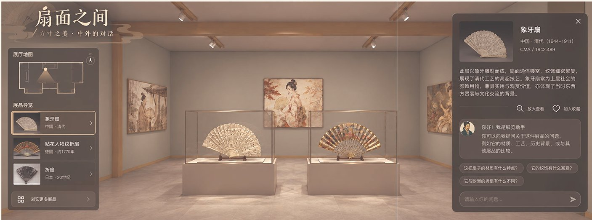

# 卧游 WoYou

**问一个问题，得到一座只属于你的 3D 虚拟展厅。展厅里的每件展品、每句说明，都能追溯到博物馆的原始著录。**

[技术笔记](docs/technical-notes.md)



卧游是一个对话式遗产策展智能体。你和 AI 策展人「彦远」聊几句——想弄懂什么、打算逛多久、对这个题材熟悉几分——它就从 Cleveland、The Met、Art Institute of Chicago 三家博物馆的 17,246 件开放馆藏里，挑出展品，写出展签，编成一场有主题、有章节的展览，并生成可漫游的 3D 展厅和一份键盘、读屏可用的 2D 版本。

名字出自宗炳《画山水序》：「澄怀观道，卧以游之。」彦远取自《历代名画记》的作者张彦远。

> 这是研究型 Demo，不是已验证学习效果的产品，也不替代专业策展。

## 它和“让大模型写一篇展览文案”有什么不同

| | 做法 |
| --- | --- |
| **展品不是模型编的** | 展品只来自冻结的开放馆藏。检索走“结构化过滤 → BM25 + 向量召回 → 重排 → 证据审查”，模型只能在本轮看过的候选里选，不能凭常识报藏品。 |
| **每句话有出处** | 主题、论点、展签都绑定馆方证据 ID。馆方原文只在「来源」面板里原样展示，不改写；AI 的观察与解读单独标注。 |
| **馆藏答不了就说答不了** | 证据不足的问题明确降级为“部分支持”或“不支持”，不拿最近邻展品凑数。 |
| **防止个性化变成信息茧房** | 每场展览至少一件 `contrast` 对照展品；元数据很薄的展品不得充当核心证据。这两条不接受参数覆盖。 |
| **展览为你的画像定制** | 来访动机、时长、熟悉程度决定展品数、章节数、展签字数和空间动线。 |

## 一次体验

```
落地页 → 策展人访谈（≤6 轮）→ 8 步策展流水线（实时可见）→ 3D 展厅 → 分享
                                                       ↘ 2D 无障碍版本（?view=text）
```

3D 展厅有导览镜头和自由行走两种模式，可随时切换；展签是可拖动、可缩放的浮窗，不会遮住藏品。

## 检索效果

自建 250 题馆藏推荐基准（100 道字段题、137 道开放语义题、13 道资料边界题）。在 100 道字段题的开发回归上：

| | Recall@50 | nDCG@10 |
| --- | ---: | ---: |
| 词法基线 BM25 | 26.91% | 0.170 |
| 早期混合检索 | 73.21% | 0.523 |
| 当前 Agentic 混合检索 | 95.02% | 0.802 |

**怎么读这组数字**：它是针对字段型问题的开发回归，不是开放问题的总体质量。137 道开放题目前只有 AI 二审，没有独立人工金标准；切换默认检索为 hybrid 的上线门槛、完整对照与未过项见 [RAG 优化验收记录](data/qa/RAG_优化验收_20260906.md)。

## 馆藏与许可

17,246 件 CC0 / Public Domain 对象，每件有公开图片和至少 2 条可定位的馆方证据：Cleveland Museum of Art 15,200 件、The Met 1,046 件、Art Institute of Chicago 1,000 件。机构分布偏向 Cleveland，不代表世界馆藏分布。许可按字段逐项记录（例如 AIC 的 `description` 为 CC BY 4.0），详见[技术笔记](docs/technical-notes.md#馆藏数据)。

## 本地运行

需要 Node.js 20+、Python 3.10+。

```powershell
npm.cmd install
python -m venv .venv
.\.venv\Scripts\python.exe -m pip install -r .\api\requirements.txt
Copy-Item .\.env.example .\.env
npm.cmd run dev
```

- 前端 <http://localhost:3000>，API 健康检查 <http://127.0.0.1:8000/health>
- **无密钥也能跑**：把 `.env` 里的 `RAG_MODE` 设为 `bm25`，只用本地 BM25，不调云端 embedding 与 rerank。
- 要用完整混合检索与生成，需在 `.env` 填 `DEEPSEEK_API_KEY` 与 `DASHSCOPE_API_KEY`，并先运行 `npm.cmd run rag:index:qwen` 和 `npm.cmd run rag:index:filters` 构建索引。
- 密钥只放服务端 `.env`，不要放进任何 `NEXT_PUBLIC_*` 变量。

测试：`npm.cmd run test`（类型检查、前端与 API 单测、离线回归）。

## 技术栈

Next.js + Three.js（前端与 3D 展厅）· FastAPI（访谈状态机、策展、任务）· SQLite FTS5 + Qwen embedding / rerank（检索）· DeepSeek（策展框架、看图写展签、证据审查）· 通义千问图像与语音（海报、导览）

```text
src/          访客路由、落地页、访谈、流水线、2D 版本、3D 展厅
api/app/      访谈状态机、检索、策展、图片代理、验证器
data/         冻结馆藏、问题卡、回归集与评测集
scripts/      多机构导入器、索引构建、离线回归
contracts/    JSON Schema
```

## 已知限制

- 8 名用户的形成性试用、遗产专业人员的内容走查、冻结环境下的性能测试尚未完成。
- 证据 ID 白名单能证明“这句话指向一份真实的输入材料”，不能证明语义上被材料蕴含；文化敏感性与来源社群审阅默认都是“未审阅”。
- 3D 展厅已在桌面与移动端真实浏览器中走查，长时间帧率与不同 GPU 下的表现未测。

更多细节——两阶段写作、CuratorialBrief、检索链路、全部配置项、评测命令——见 [技术笔记](docs/technical-notes.md)。

## 致谢

馆藏数据来自 [Cleveland Museum of Art Open Access](https://openaccess-api.clevelandart.org/)、[The Met Open Access](https://metmuseum.github.io/) 与 [Art Institute of Chicago API](https://api.artic.edu/docs/)。

